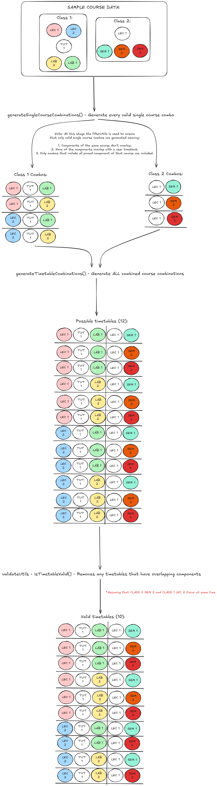

# Timetable Generation Documentation

This document explains how timetable generation works in this project. It is the major and critical part of the project and as such has its own documentation separate from the rest of the project.

## timetableGeneration Directory

The timetableGeneration directory is the location within the project that strictly only holds all the code necessary to generate timetables. Timetable generation code is the code that actually creates the valid set of combinations of courses. It does NOT include things like creating the events in the calendar or adding them.

- [**src/GeneratorPage/scripts/timetableGeneration**:](#docs) This is the location of the timetableGeneration directory.

## Understanding Flow of Timetable Generation

Here is a basic high-level diagram example of how timetable options are generated:

## timetableGeneration.js

In the timetableGeneration directory you will notice a file named timetableGeneration.js this is the entry point of the timetable generation process. It runs the high level flow of timetable generation as seen in the diagram above by bringing all the smaller chunks/modules (referred to as "utils" in this project) together.

- **generateTimetables()**: This is the main timetable generation function. It runs the flow of generating timetables and handles time-block overrides by regenerating timetables if the user time-blocked all available timetable options. This function is called from multiple parts of the project whenever timetable need to be generated.

- **getValidTimetables()**: Simple getter function which returns the current valid timetables.

- **getGenerationPerformance()**: Simple getter function for performance metrics (used internally for debugging)

## Utils

The timetable generation process is made up of multiple small utility modules ("utils") that each handle a focused part of the logic.

### **timeUtils.js**

Handles all operations related to time conversion and slot availability:

- **`timeToSlot(timeString)`**: Converts a human-readable time string like `"830"` or `"1430"` into a slot index, where each slot represents a 30-minute block starting from 8:00 AM.
- **`isSlotAvailable(timeSlots, day, start, end)`**: Checks whether a specific time range on a given day is available (i.e., not blocked).
- **`calculateBlockedPercentage(component, timeSlots)`**: Calculates how much of a component's scheduled time is blocked in the user's availability map.

---

### **filterUtils.js**

Filters down component options based on user constraints:

- **`filterComponentsAgainstTimeSlots(components, timeSlots, enableFallback)`**: Returns only the groups of components that fit within the user’s time availability.
- **`filterPinned(components, courseCode, componentType)`**: If the user has pinned components, this filters down to only those components or ones matching pinned base IDs.
- **`filterByDuration(components, duration)`**: Filters components that match a specified semester duration.

---

### **combinationUtils.js**

Generates combinations of course components into full timetable options:

- **`cartesianProduct(arrays)`**: Creates a Cartesian product of input arrays (i.e., all possible combinations of items across arrays), with truncation logic to prevent performance overload.
- **`generateSingleCourseCombinations(course, timeSlots, enableFallback)`**: Builds all valid lecture + lab + tutorial + seminar combinations for a single course, using the filter utilities.
- **`generateTimetableCombinations(courseCombinations, performanceMetrics)`**: Combines all per-course combinations into full timetable candidates. Tracks performance and prevents excessive growth.

---

### **validateUtils.js**

Validates and checks schedule consistency for a given timetable:

- **`isTimetableValid(timetable)`**: Checks that no class components in the timetable overlap in date, time, or day. Returns `true` only if the entire timetable is conflict-free.

---

### **sortUtils.js**

Used to score and sort timetables for user-friendly display:

- **`calculateWaitingTime(timetable)`**: Calculates the total "dead time" between classes on the same day (in minutes).
- **`calculateClassDays(timetable)`**: Returns the number of distinct days in the week that have classes scheduled.

---

### **UIEventsUtils.js**

Centralizes UI-related functions for UI changes such as notification related to the timetable generation process.

- **`emitNoValidTimetablesFound()`**: Triggers a UI error notification when no valid timetables can be generated.
- **`emitTimetableOverridden()`**: Triggers a UI warning when user-defined time blocks are overridden to make generation possible.
- **`emitTruncationWarning()`**: Notifies that some timetable combinations were truncated due to size.
- **`clearOverriddenFlag()` / `clearTruncationFlag()`**: Removes truncation notification info icon.
- **`sortTimetableIndexReset(newSort, prevSort)`**: Resets the UI’s current timetable index when the sort option changes. Although it does not directly notify the user it is a UI Event driven state change.

---

### **componentIDUtils.js**

Handles component ID parsing:

- **`getBaseComponentId(componentId)`**: Strips any suffixes (like "-1", "-2") from component IDs to determine the "base" component. This is used to group related components across types and sections.
